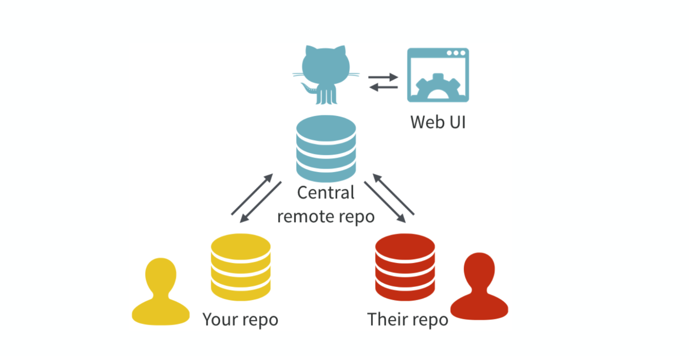
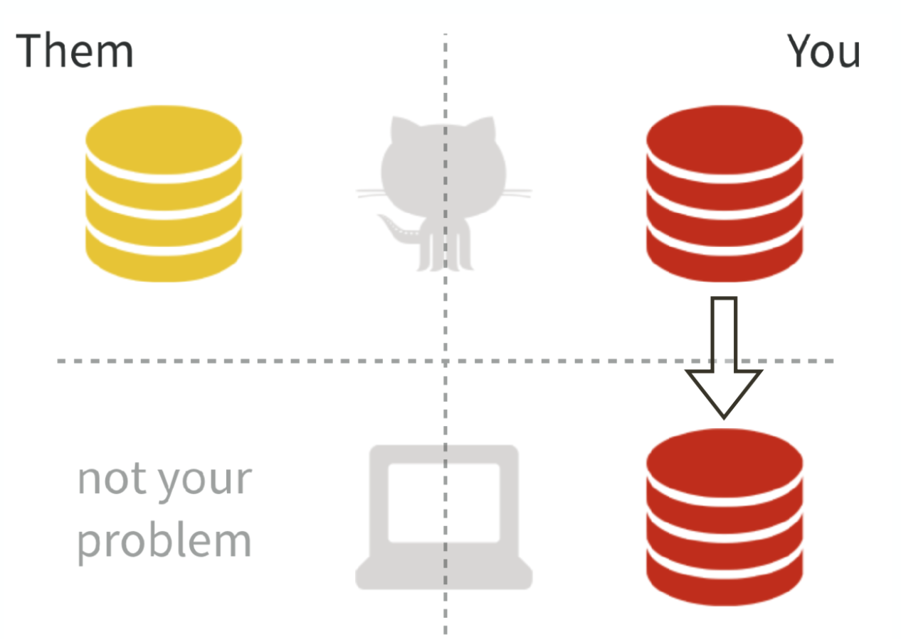
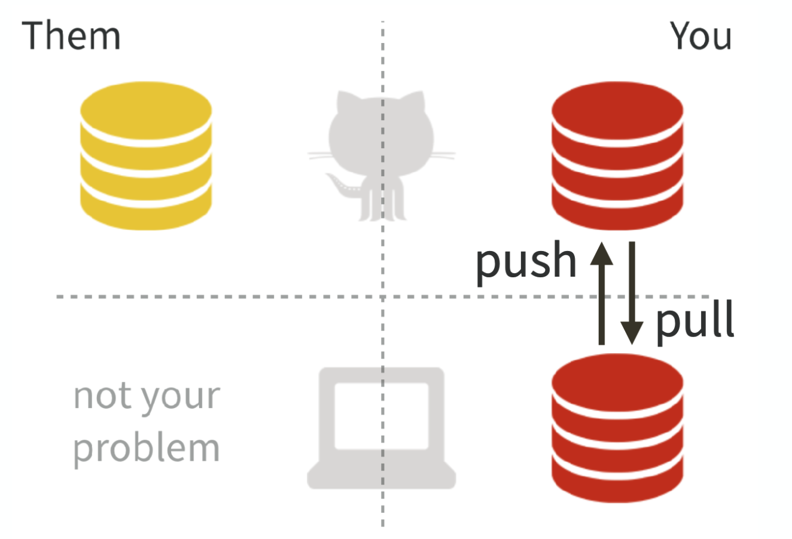
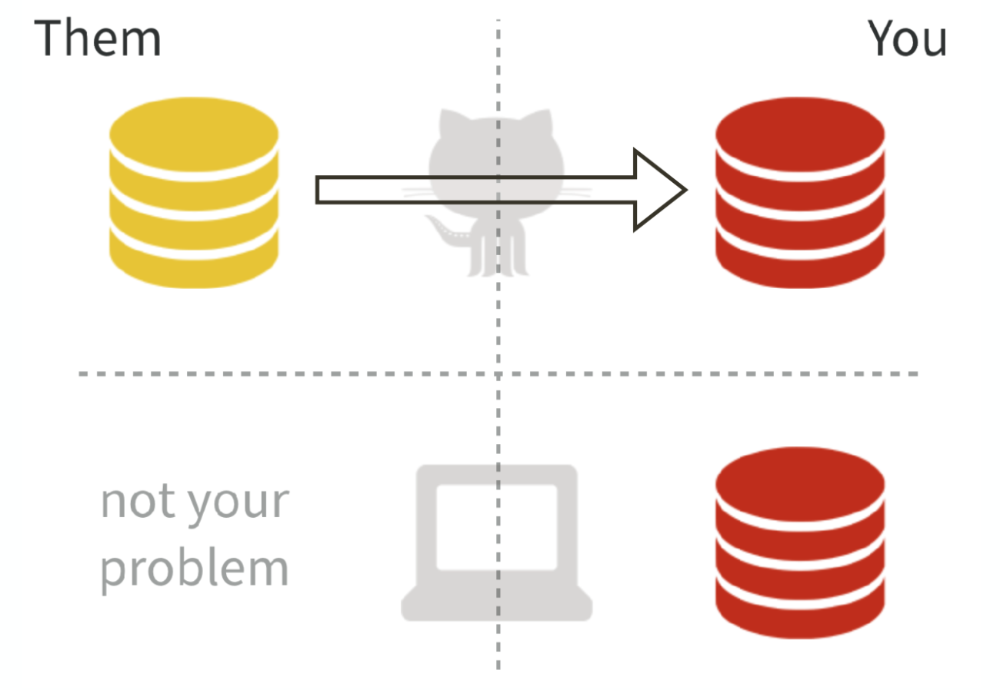
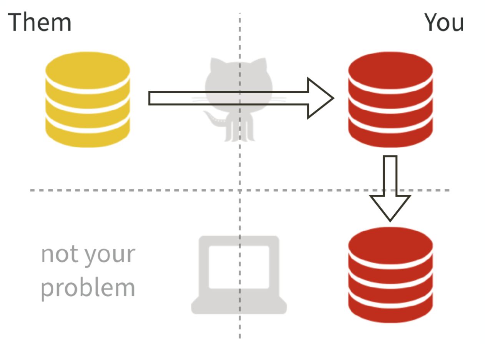
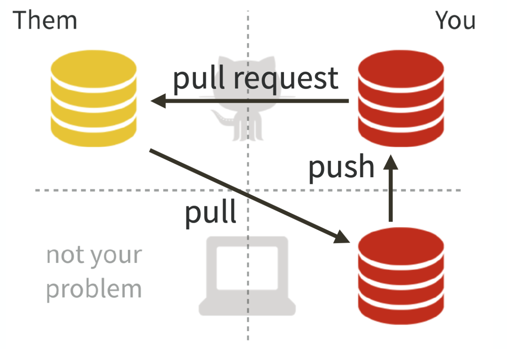

class: fullscreen, inverse, bottom, left, text-white
background-image: url("images/me-speaking.jpg")

.font150[**Hi, I'm Jason. <br>I like to gesture at screens.**]

**Digital Engagement Librarian**, University of Nebraska at Omaha<br>Mentor, **Mozilla Open Leaders**<br>Researcher,  **Humanities+Design**, Stanford University


```{r setup, include=FALSE}
as_table <- function(...) knitr::kable(..., format='html', digits = 3)
options(htmltools.dir.version = FALSE)
knitr::opts_chunk$set(dev = 'svg')
options(device = function(file, width, height) {
  svg(tempfile(), width = width, height = height)
})
```

---

# What is version control? 

1. Tracking changes through "repositories"
2. Controlling which changes are implemented in individual files 
3. Designed for software code, but adapted by data scientists + others

## Why version control?

- experiment without fear
- explore cause and effect
- embrace incrementalism
- collaborate 
- expose your work

---

# Git + GitHub

## Why Git?

1. Robust and widely adopted
2. Flexible workflow 
3. Good for collaborative work

## Why GitHub?

1. Hosted site for using Git
2. Open by default
3. Private repos available for .edu accounts

You'll be using GitHub a lot for this course! Expect at least two `repos`: personal (for individual assignments) and team (for team assignments).

---

# Three ways to use GitHub

- **Command line interface**: using Terminal (macOS) or a third-party app on Windows (Cygwin), you enter text commands to complete git management tasks. 
- **GitHub Desktop**: Using the desktop app, you can drag-and-drop actions in a user interface. 
- **GitHub in the browser**: Using your browser on the GitHub website, you can do all the same things as other tools. 

Be mindful of the workflow: most of the time, the changes you're making to the files in a repository are made in another app (a text editor or command-line clients).

---
class: center, middle

Use a Git client, if you'd like. There's no 🤘Hardcore Nerd🤘 Git badges. 

There's no "best" way here -- use what works for you.

---
layout: none



---

# Git + GitHub

.left-column[
### Concepts
]

.right-column[
  `commit`: a file or project state **that is meaningful for you** 
]

---

# Git + GitHub

.left-column[
### Concepts
]

.right-column[
  `commit`: a file or project state **that is meaningful for you** 

  `diff`: what changed here? why?
]

---

# Git + GitHub

.left-column[
### Concepts
]

.right-column[
  `commit`: a file or project state **that is meaningful for you** 

  `diff`: what changed here? why?
  
  `fork`: make a remote copy of a repository
]

---

# Git + GitHub

.left-column[
### Concepts
]

.right-column[
  `commit`: a file or project state **that is meaningful for you**

  `diff`: what changed here? why?
  
  `fork`: make a remote copy of a repository
  
  `clone`: make a local project from a remote repo
]

---

# Git + GitHub

.left-column[
### Concepts
]

.right-column[
  `commit`: a file or project state **that is meaningful for you**

  `diff`: what changed here? why?
  
  `fork`: make a remote copy of a repository
  
  `clone`: make a local project from a remote repo
  
  `push`: upload a local repository to a remote repository
]

---

# Git + GitHub

.left-column[
### Concepts
]

.right-column[
  `commit`: a file or project state **that is meaningful for you** 

  `diff`: what changed here? why?
  
  `fork`: make a remote copy of a repository
  
  `clone`: make a local project from a remote repo
  
  `push`: upload a local repository to a remote repository
  
  `merge`: take independent lines of development and integrate them into a single branch
]

---

# Git + GitHub

.left-column[
### Concepts
]

.right-column[
  `commit`: a file or project state **that is meaningful for you** 

  `diff`: what changed here? why?
  
  `fork`: make a remote copy of a repository
  
  `clone`: make a local project from a remote repo
  
  `push`: upload a local repository to a remote repository
  
  `merge`: take independent lines of development and integrate them into a single branch
  
  `fetch`: downloads commits, files, and refs from a remote
]

---

# Git + GitHub

.left-column[
### Concepts
]

.right-column[
  `commit`: a file or project state **that is meaningful for you**

  `diff`: what changed here? why?
  
  `fork`: make a remote copy of a repository
  
  `clone`: make a local project from a remote repo
  
  `push`: upload a local repository to a remote repository
  
  `merge`: take independent lines of development and integrate them into a single branch
  
  `fetch`: downloads commits, files, and refs from a remote
  
  `pull`: fetch and download content from a remote repository & immediately update local repository to match (`fetch` + `merge`)
]

---

# `git clone`



---

# `git push` & `git pull`



---

# `git fork`



---

# `git fork` & `git clone`



---

# `git pull` & `git push`




---

# GitHub

.left-column[
### For more than code
]

.right-column[

Writing a book
- Fork the Cookbook - recipe modification traceability 
- <http://forkthecookbook.com/about>

Publication review
- ReScience - Peer-reviewed journal
- <https://github.com/ReScience/ReScience>

Collaboration
- Designing fonts
- <https://github.com/theleagueof>
  
]

---
class: fullscreen, inverse, bottom, center, text-white
background-image: url("https://media.giphy.com/media/XreQmk7ETCak0/giphy.gif")

# Time to get hands-on with git!


---

# Git activity

- Practice: <https://learngitbranching.js.org>
  - Emulator for a git command line experience without actually using your system
  - Work through the introduction sequence (parts 1-4)
  - 15 minutes

- Create your first repo: <https://github.com/>
  - Find the "+" in the upper right side of the screen to create a new repo
  - Give it any name you wish. Select the checkbox to include a README.
  - Create a new file called `helloworld.md` and in the document write "Hello world!" 
  - 5 minutes
  
If you finish quickly, help someone else! 

---
class: fullscreen, inverse, bottom, center, text-white
background-image: url("images/break.jpg")

# Let's take a break. Come back in 5 minutes.
(My favorite place in the world: the Yosemite valley)


---

# Git activity

Let's work through this together. We'll spend the next 30 minutes, using the browser only:

1. **Owner of master**: This is our `master` source: <https://github.com/unolibraries/intro-github-isqa>
2. **Rest of the group**: `fork` that repo!
3. **Each person**: add one file to your forked repo that is labeled with your last name and favorite flavor of ice cream in the format: `lastname-flavor.md`.
4. **Each person**: After you've made changes, `commit` those and issue a **pull request** to the master `repo`. The **owner of master** will review pull requests and merge.
5. **Each person**: `fetch` to [get new files](https://github.com/KirstieJane/STEMMRoleModels/wiki/Syncing-your-fork-to-the-original-repository-via-the-browser), edit a few files at least once (describe the flavor or update the description), and make a **pull request** to upload the changes.
5. **Owner of master**: Review pull requests and integrate changes.
6. Do a few additional `fetch` and `pull requests`. Do a few `push` and `pull` actions.

---