[Palladio](palladio.designhumanities.org) was built by Stanford University's Humanities+Design lab in the Center for Spatial and Textual Analysis (CESTA). The tool is designed for web-based data visualization and working with humanities data, providing a set of tools for examining and visualizing data in various ways. 

## Why Palladio might be the right tool

*1. You have structured data.*

By "structured data" we mean data tabulated in a spreadsheet.

*2. You're interested in relationships, time, and space.* 

Palladio offers various ways of viewing your data and how various facets are related.

*3. Your data has several attributes.*

Palladio excels at uncovering relationships among attributes over time and space.

## Why Palladio might not be the right tool

*1. You have unstructured data.*

If you want to analyze long pieces of text, such as a poem or novel, Palladio isn't the right tool. You'll want to look into alternatives for text analysis, such as [Voyant](http://voyant-tools.org/).

*2. You want to count items.*

If you want simple bar charts and graphs, Palladio is too much tool. Try instead Excel, Plot.ly, or Tableau.

*3. You want to present an interactive visualization.*

Currently, Palladio cannot be embeded elsewhere or easily share the visualizations you create. While it's great for exploring your data, it isn't useful for presenting information.

*4. You want complex or custom maps and networks.*

While Palladio can produce maps and network graphs, you can't perform sophisticated analysis. You might consider tools like CARTO or Gephi if you need more.

## Getting Started

For the workshop, we'll look at the Charles Weever Cushman Collection of photographs from Indiana University (http://webapp1.dlib.indiana.edu/cushman/index.jsp). This spreadsheet contains metadata from the collection, which includes some 14,500 Kodachrome photographs taken between 1938 and 1969. The data is availabile in full on Github (https://github.com/iulibdcs/cushman_photos), but we'll be using a set of data limited between 1938 and 1955 to make it a little easier to work with.

Some tips:

-   The software can still be buggy. Take your time.
-   Do not refresh the page. Memory is stored in the browser, which means if you refresh or navigate to a new page, your work is lost.
-   Clicking the **Palladio** logo will take you to the homepage, but it won't erase your work.
-   You can download a `.palladio` JSON file anytime to save your work, or come back to it on a later date.

## Navigate to Palladio

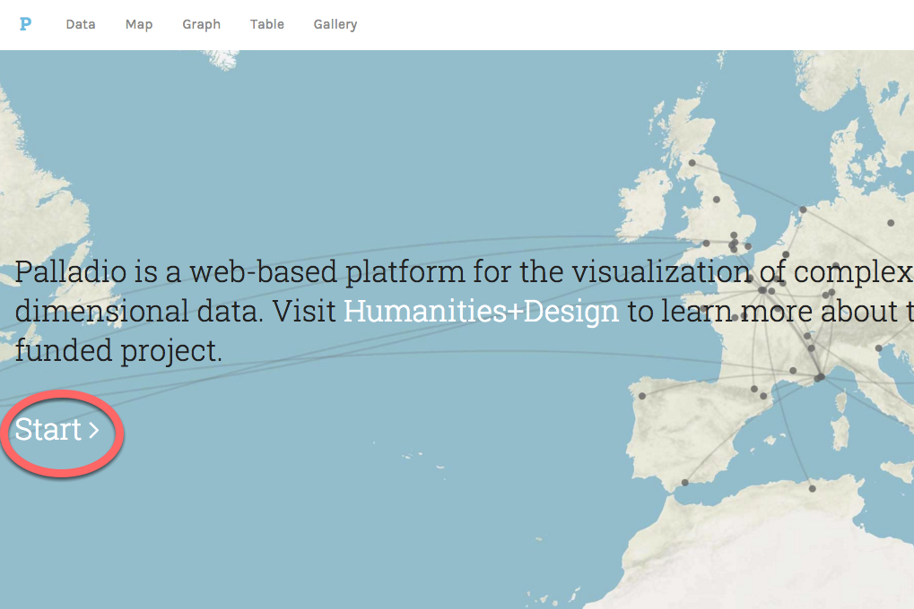

Go to palladio.designhumanities.org and click **Start**.

## Upload your data

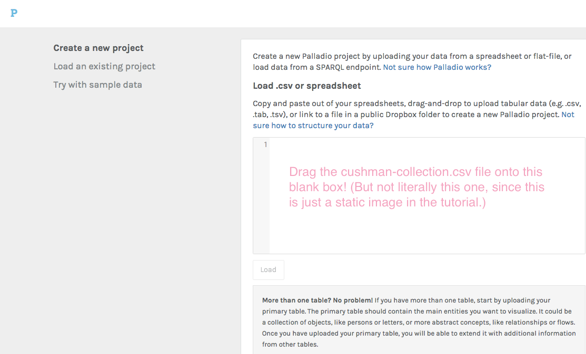

Locate the `Cushman-Collection.csv` file your downloaded. Click and drag the file into the blank box that appears under **Load CSV or spreadsheet**. Then press **Load**.

## Exploring and checking your data

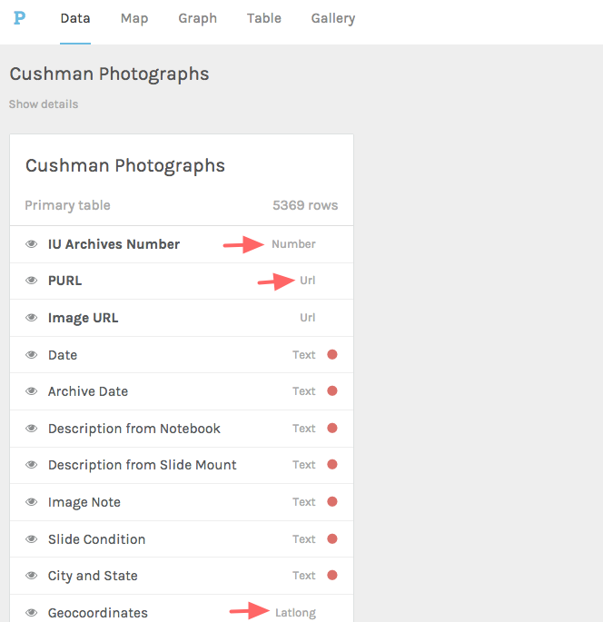

As you can see, each column of the spreadsheet is a category of data. You can see Palladio has categorized the different datatypes such as date, integer, string, or latlong.

At this stage, you'll want to double-check that Palladio has identified the datatypes correctly. We want to be sure, for example, that category or temporal data is properly identified.

## Let's make a map

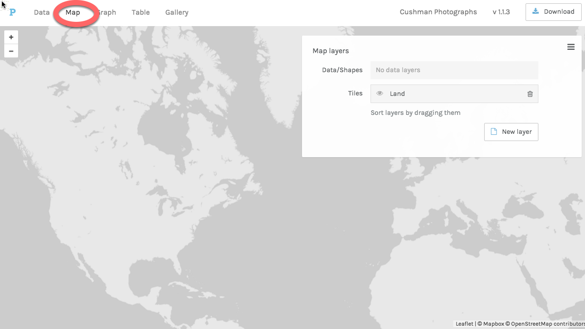

Click on the **Map** tab at the top of the window to go to the map view. Before we start, let's notice the **Map Layers** pane that appears here.

Palladio expects you to build the map in layers. This means not only can we map one kind of thing, like photographs; you could layer other kinds of things on top of that data such as interstate road networks. But for now, let's stick with Cushman's photographs.

## Map your data

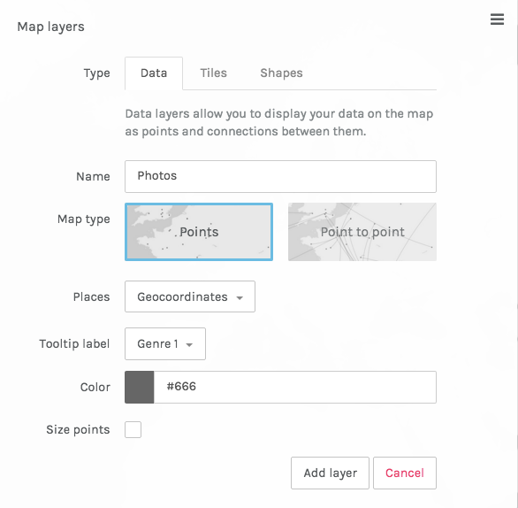

Click **New layer** to open the `Map Layers` window. Tell Palladio what we want in the layer and give the layer a name. We'll call this "Photos." Keep the map type as **Points**. If you had data where you wanted to indicate movement, you could do point-to-point.

Click on the **Places** box and choose **Geocoordinates** from the dropdown.

The **Tooltip Label** controls the label you see when your cursor hovers over a point. Call this "Genre 1" so we have some idea of what's in the photograph.

When you're done, click *Add layer**.

## Boom. Map.

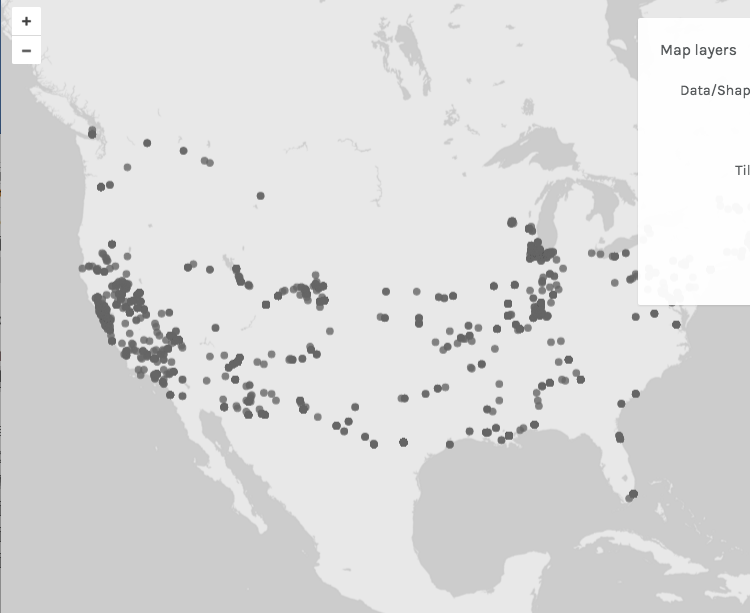

Looks good! If you hover over a point, you should see the tooltip pop up.

## Exploring the timeline

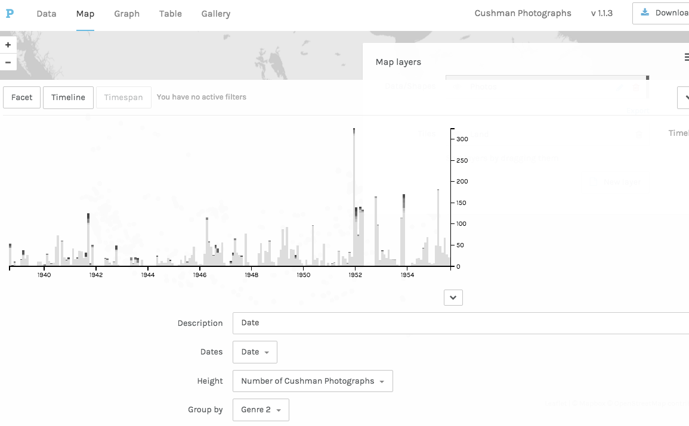

The ability to put data on a map is great, but the real power of Palladio is to slice through data to get different views and explore relationships. **Facets** and **Timelines** are the core features for doing this. Let's start with a timeline: a visualization of the distribution of your data over time.

Click **Timeline** at the bottom tab. Group your data by **Genre 1**. Now you see the distribution of photos over time.

## Filter your data by date

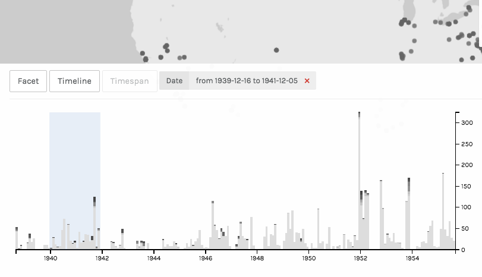

On the bottom graph, use the crosshairs to drag from 1940 to 1942. You'll see a box indicating you're filtering the data by date. Notice the points on the map repopulate based on the timespan you've selected. You can even select multiple timespans and see them visualized simultaneously!

You can temporarily close the timeline by selecting the down arrow so you can see the map better. To delete the filter, select the trash can icon. 

## Add facets to refine your data

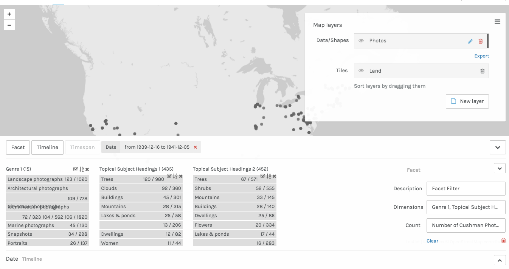

We've narrowed the data down to 1940-1942, now let's try filtering the data using other attributes. We can do this with **Facet** filters.

Click on the **Facet** tab, and select the **Dimensions** menu. Now select **Genre 1**, **Topical Subject Heading 1**, and **Topical Subject Heading 2**. 

## Explore facets

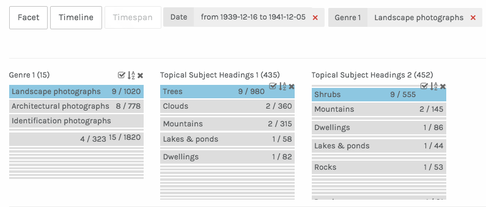

Working from left to right, the facet dimensions narrow down the data displayed on the map. We can see where Cushman took landscape photographs that contain both trees and shrubs, for example. 

Try playing around with some other facets and altering your timeline. Find any interesting relationships?

## Exploring data as a gallery

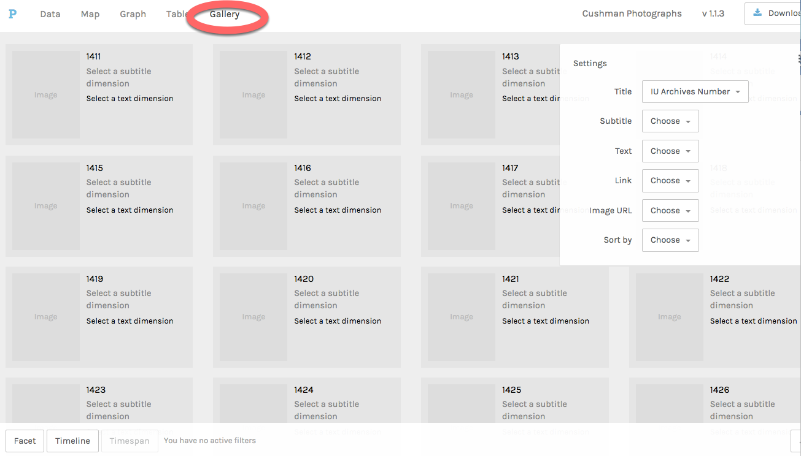

Maps are great, but you can also build galleries. First, **delete the time and facet filters**. Now, select the **Gallery** tab at the top of the window.

## Change categories your gallery displays

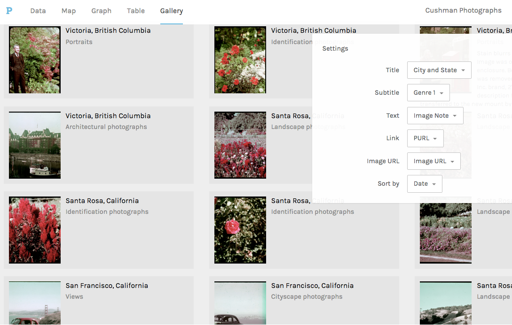

Select the categories for your gallery. For **Title** choose **City and State**. For **Subtitle** select **Genre 1**. For **Text** select **Description from Notebook**. For **Link URL** select **PURL**. For **Image URL** select **Image URL**. You can also sort by **Date** if you'd like.

## Filter the gallery by attributes

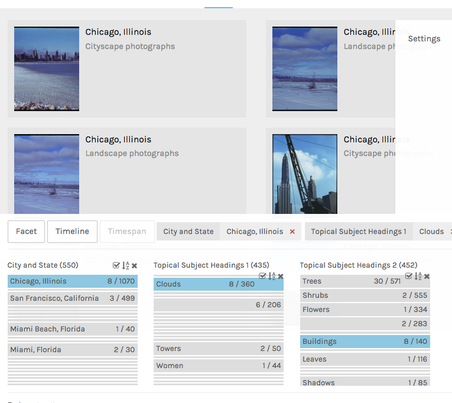

You can filder the gallery the same way we filtered the map. Go ahead and add some facet filters, try to create a gallery of photographs taken in Chicago that contain buildings.

## Viewing your data as a network graph

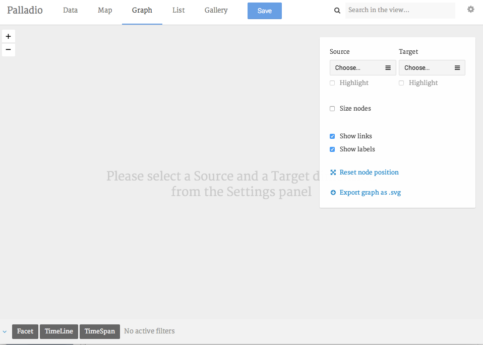

Network diagrams are also great tools for showing relationships. Often these entities are people or objects, but let's try this with subject headings. 

To view the network diagram, get rid of your facet filters and click on **Graph**.

## Establish some parameters for your network

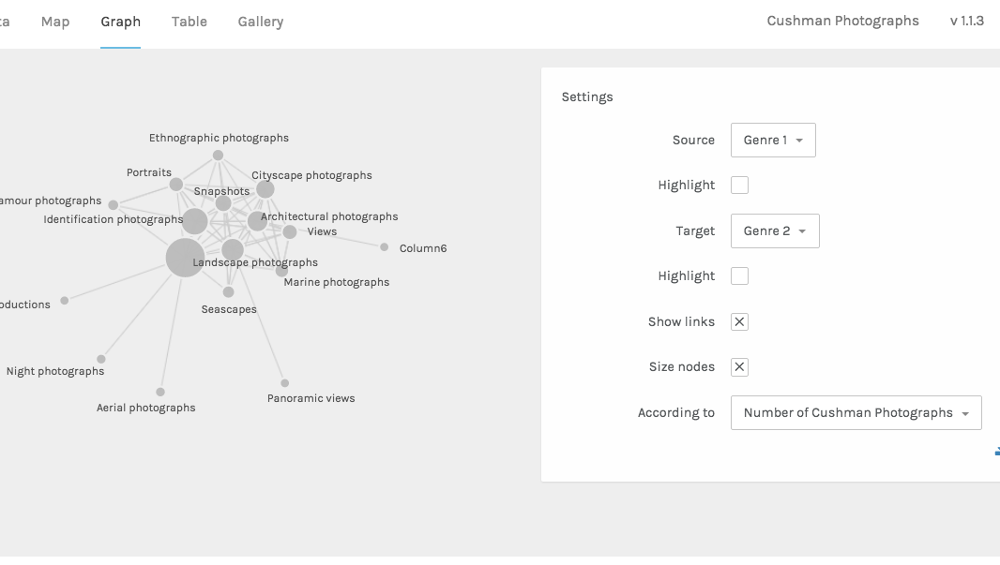

To create a network diagram, you need to tell Palladio which two attributes are related. For **Source** select **Genre 1**, for **Target** select **Genre 2**. You can see which genures tend to co-occur in Cushman's photographs. You can click and drag the nodes to explore the diagram.

To highlight a particular kind of node, you can check the **Highlight** checkbox. To size nodes by the number of objects they represent, select the **Size nodes** checkbox. 

As before, you can filter the network with facets and timelines.

## Download your work

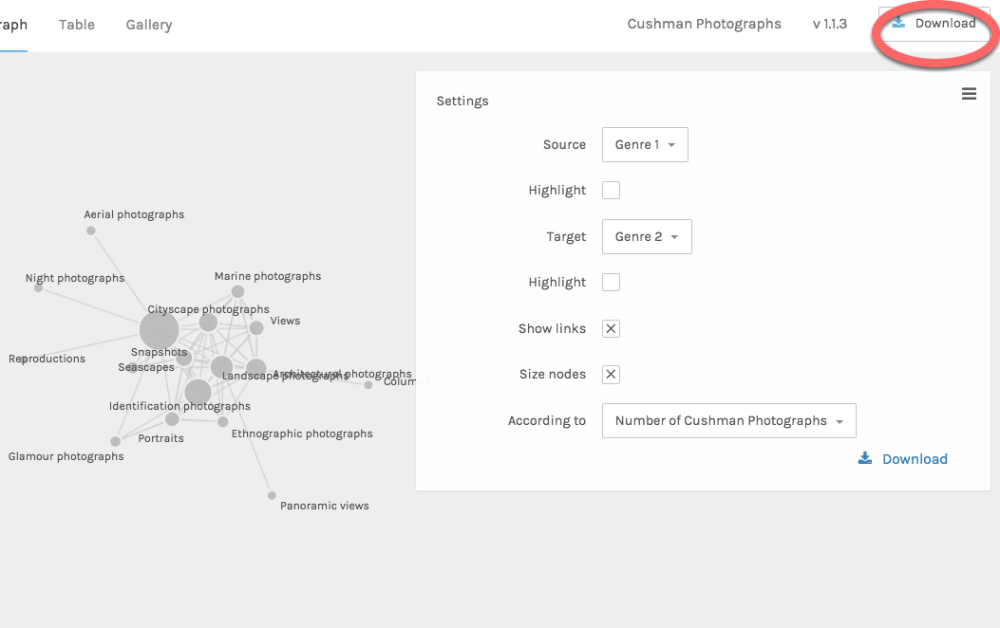

Palladio doesn't save your data, but you can export the data model and upload it again later. This will save you the trouble of configuring your dataset the next time you want to work with it. 

Select **Download** at the top right of the window, which will download a `.json` file. The next time you use Palladio, you can upload this file in order to open your project where you left off.

## What else can Palladio do?

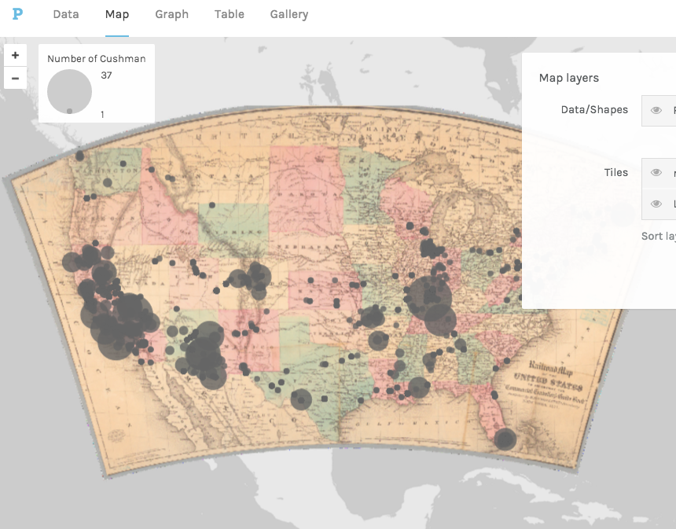

There are a few things we haven't discussed here that Palladio can do:

-   using georeferenced historic maps as a map layer
-   work with multiple tables of data, connected relationally
-   export lists of data using the same filtering mechanism we used for visualizations
-   create point-to-point maps
-   visualize spans of time with the timespan filter

